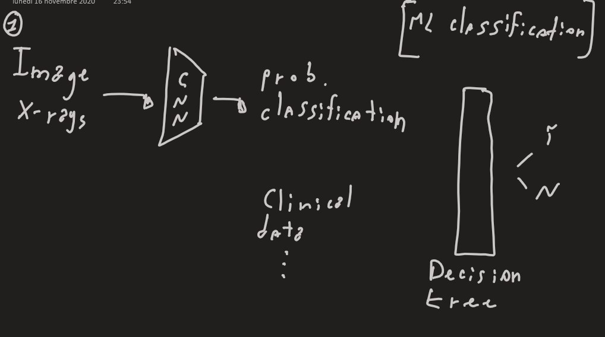
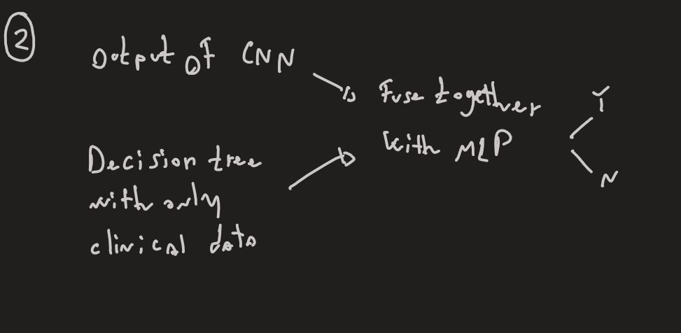

# [Information for the Hackathon on COVID-19.](https://ai4covid-hackathon.it/)
[link of the data](https://drive.google.com/file/d/1KH0KqC2yOzT1ImUOGrlYUduQoIPfW0HU/view)

- CNN --> Resnet34 pretrain on Imagenet
- train on more data from internet (Kaggle)
- data augmentation to increase the quantity of data (flip, rotation)
- SVM, LR, DT
- decide the flow of the Loss inside the architecture

Two possible approaches:

1. Images on the CNN and consider the output as a classificator with the prob.
Take the clinical data as input of the second part with also the output of the CNN.

2. Consider separately the 2 data types and merge in a MLP final classificator.  

### Their work:
Images and clinical data were analyzed using 3 machine learning methods and radiomics: support vector machine (SVM), logistic regression (LR) and decision trees (DT). Model were validated with 10-fold and center-wise cross-validation. Our AI-based algorithms showed 74%, 75%, 65% and 73%, 75%, 60% accuracy with 10-fold and center-wise cross validation respectively.

“Soda P, et al. AIforCOVID: Predicting the clinical outcomes in patients with COVID-19 applying AI to chest-X-rays. An Italian multicentre study. Med Image Anal. 2021 Aug 28;74:102216. doi: 10.1016/j.media.2021.102216
